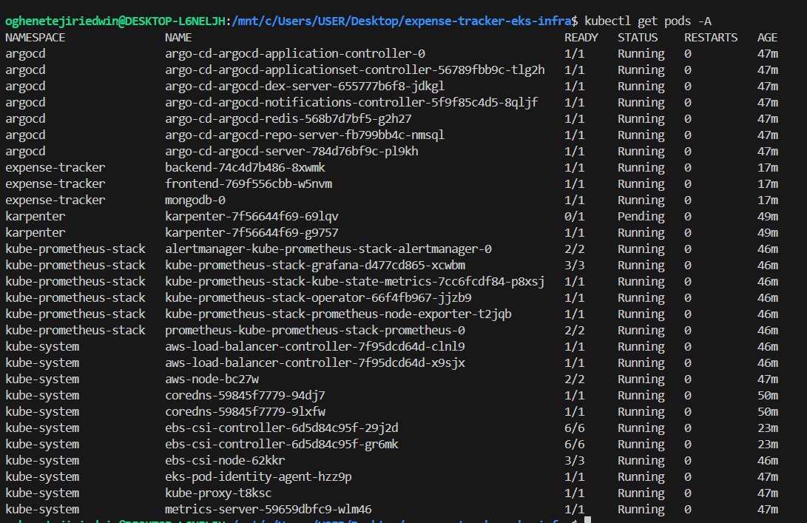
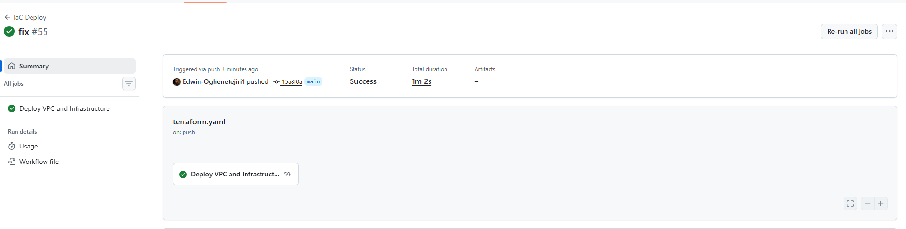
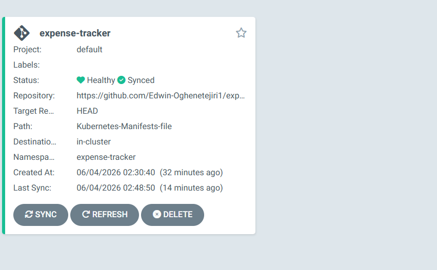
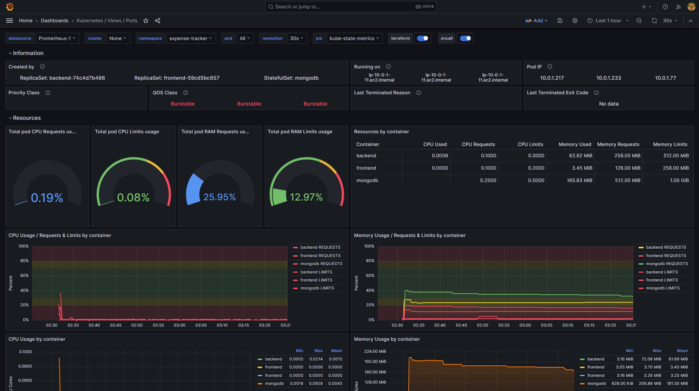
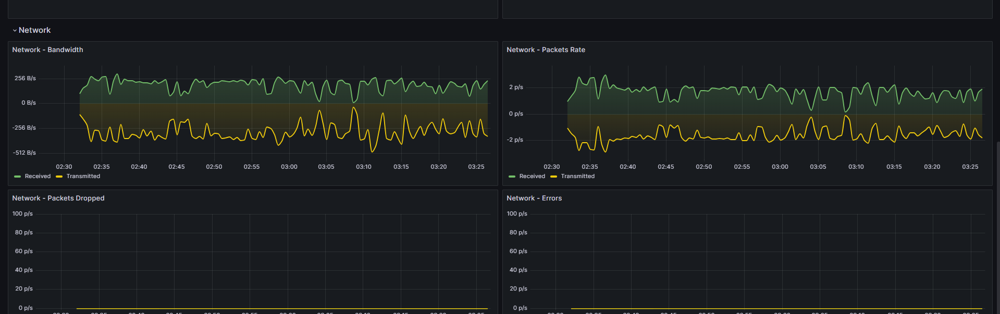
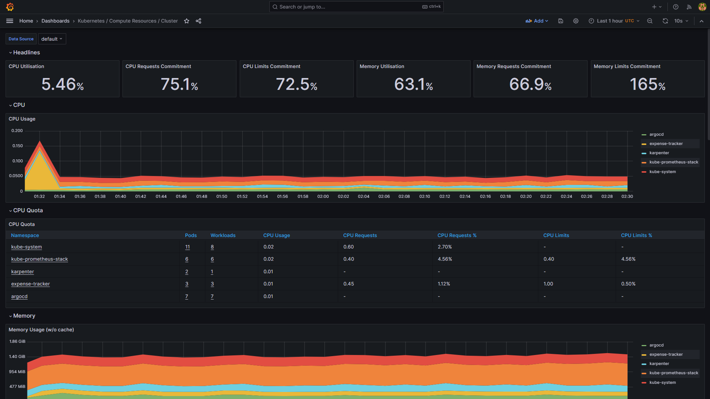
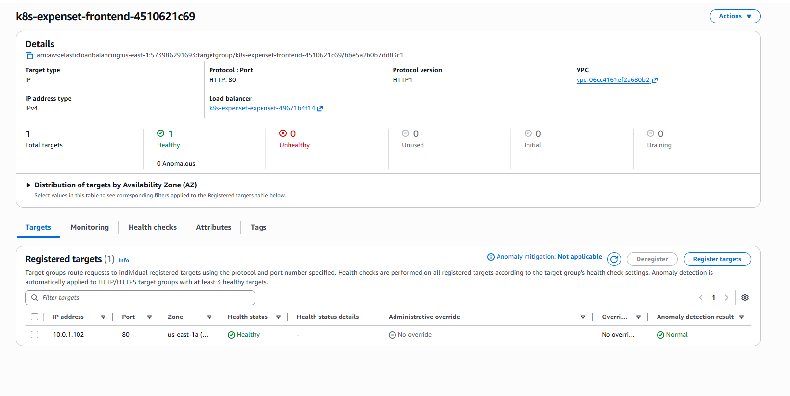

# Expense Tracker EKS Infrastructure

Production-grade AWS EKS infrastructure for the Expense Tracker MERN application, provisioned with Terraform and deployed via GitHub Actions CI/CD pipeline using GitOps principles.

## Architecture


### Infrastructure Components

- **VPC** — 3-tier network with public/private subnets across 2 Availability Zones, multi-AZ NAT Gateways for high availability
- **EKS Cluster** — Managed Kubernetes on AWS with node groups using `c7i-flex.large` instances
- **Karpenter** — Intelligent node autoscaling based on pod resource requirements
- **AWS Load Balancer Controller** — Manages ALB ingress resources automatically
- **ArgoCD** — GitOps continuous delivery, watches the manifests repo and auto-syncs on every merge
- **Prometheus + Grafana** — Full cluster observability and monitoring
- **EBS CSI Driver** — Persistent storage for MongoDB StatefulSet

### Security Highlights

- **OIDC Authentication** — GitHub Actions assumes an IAM role via OIDC. No AWS access keys stored anywhere
- **AWS Secrets Manager** — Sensitive Terraform variables stored securely, fetched at pipeline runtime
- **tfsec** — Infrastructure security scanning on every push
- **Private subnets** — All workloads run in private subnets, never directly exposed to the internet
- **Pod Identity** — EBS CSI driver uses EKS Pod Identity instead of node-level IAM permissions
- **State locking** — S3 backend with native file locking prevents concurrent Terraform runs
- **ACM + Route 53** — SSL certificates managed by AWS, DNS via Route 53

---

## Repository Structure

```
expense-tracker-eks-infra/
├── .github/
│   └── workflows/
│       └── terraform.yaml       # CI/CD pipeline
├── eks-prod/
│   └── modules/
│       ├── eks/                 # EKS cluster, node groups, IAM, OIDC
│       └── vpc/                 # VPC, subnets, NAT gateways, route tables
└── infra-addons/
    ├── main.tf                  # Root module — VPC, EKS, addons, Karpenter
    ├── variables.tf             # All input variables
    ├── outputs.tf               # Cluster endpoint, VPC ID, subnet IDs
    ├── kubernetes.tf            # K8s secrets, ArgoCD repo, Karpenter Helm + NodePool
    ├── version.tf               # Provider versions and backend config
    ├── application.yaml         # ArgoCD Application manifest
    ├── ingress.yaml             # ALB ingress for ArgoCD, Grafana, expense tracker
    └── vars/                    # tfvars directory (gitignored)
```

---

## CI/CD Pipeline

The GitHub Actions pipeline (`TF_destroy` flag controls deploy vs destroy):

```
Push to main (infra-addons/** changes)
        ↓
tfsec security scan (soft fail)
        ↓
Configure AWS credentials via OIDC
        ↓
Terraform Init (S3 backend)
        ↓
Fetch dev.tfvars from AWS Secrets Manager
        ↓
Terraform fmt → validate → plan
        ↓
Terraform Apply (TF_destroy=false)
        ↓
Update kubeconfig
        ↓
kubectl apply application.yaml + ingress.yaml
        ↓
ArgoCD syncs expense-tracker-k8s-manifests repo
```

### Destroy (cost saving)
Set `TF_destroy: true` in the workflow and push — the pipeline tears down all resources in reverse order. Flip back to `false` to redeploy. All state is preserved in S3.

---

## Prerequisites

- AWS CLI configured with appropriate permissions
- Terraform >= 1.5.0
- kubectl
- GitHub repository secrets configured (see below)

---

## GitHub Secrets Required

| Secret | Description |
|---|---|
| `AWS_ACCOUNT_ID` | Your 12-digit AWS account ID |
| `AWS_ROLE_NAME` | IAM role name for GitHub Actions OIDC |
| `AWS_DEFAULT_REGION` | AWS region (e.g. `us-east-1`) |
| `BUCKET_TF_STATE` | S3 bucket name for Terraform state |
| `DYNAMO_DB_LOCK` | DynamoDB table name for state locking |

---

## AWS Resources Required (one-time setup)

```bash
# S3 bucket for Terraform state
aws s3api create-bucket \
  --bucket <your-bucket-name> \
  --region us-east-1

aws s3api put-bucket-versioning \
  --bucket <your-bucket-name> \
  --versioning-configuration Status=Enabled

# DynamoDB table for state locking
aws dynamodb create-table \
  --table-name terraform-lock \
  --attribute-definitions AttributeName=LockID,AttributeType=S \
  --key-schema AttributeName=LockID,KeyType=HASH \
  --billing-mode PAY_PER_REQUEST

# Store sensitive variables in Secrets Manager
aws secretsmanager create-secret \
  --name dev.tfvars \
  --secret-string file://dev-env.tfvars

# OIDC IAM role for GitHub Actions
# See docs/oidc-setup.md for full instructions
```

---

## Cluster Addons

| Addon | Purpose |
|---|---|
| AWS Load Balancer Controller | Provisions ALB from Kubernetes Ingress resources |
| Karpenter | Node autoscaling — launches nodes on demand |
| Kube Prometheus Stack | Prometheus + Grafana monitoring |
| Metrics Server | Enables HPA (Horizontal Pod Autoscaler) |
| ArgoCD | GitOps CD — syncs manifests repo to cluster |
| EBS CSI Driver | Persistent volume support for StatefulSets |

---

## Live URLs

| Service | URL |
|---|---|
| Expense Tracker App | https://app.retrogameshop.online |
| ArgoCD Dashboard | https://argocd.retrogameshop.online |
| Grafana Dashboard | https://grafana.retrogameshop.online |

---

## VPC Design

```
VPC — 10.0.0.0/16
├── Public subnet AZ-a (10.0.3.0/24) — NAT GW, ALB
├── Public subnet AZ-b (10.0.4.0/24) — NAT GW, ALB
├── Private subnet AZ-a (10.0.1.0/24) — EKS nodes
└── Private subnet AZ-b (10.0.2.0/24) — EKS nodes
```

Multi-AZ NAT Gateways ensure that if one AZ goes down, pods in the other AZ can still reach the internet.

---

## Related Repositories

- [expense-tracker](https://github.com/Edwin-Oghenetejiri1/expense-tracker) — MERN stack microservice
- [expense-tracker-k8s-manifests](https://github.com/Edwin-Oghenetejiri1/expense-tracker-k8s-manifests) — Kubernetes manifests

---

## Author

**Edwin Oghenetejiri Ayomide**  
DevOps & Cloud Engineer  
[github.com/Edwin-Oghenetejiri1](https://github.com/Edwin-Oghenetejiri1) | [retrogameshop.online](https://retrogameshop.online)

## Screenshots

### Cluster — all pods healthy


### GitHub Actions — green pipeline


### ArgoCD — Synced and Healthy


### Grafana — cluster monitoring





### ALB — healthy targets
